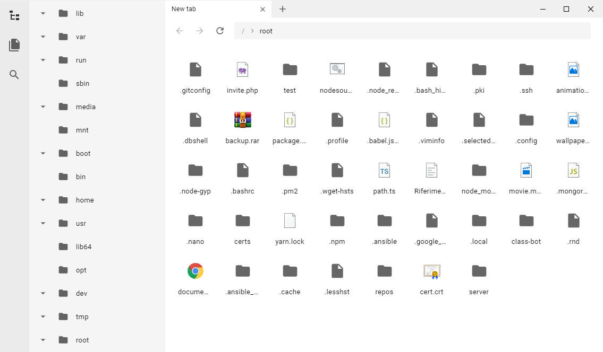

<div align="center">
  
  <h1>Qusly</h1>
  📁 Qusly is an FTP/FTPS/SFTP client built on top of Electron, React, Styled-Components and <a href="https://www.github.com/xnerhu/qusly-core">Qusly-Core</a>, focused on User-Experience and features.
</div>

## Screenshots

<div style="text-align: center">

</div>

## Roadmap

- [ ] Connection dialog
- [ ] Path input
- [ ] Transfer list
- [x] Directory tree
- [ ] Context menu
- [ ] Search
- [ ] Bookmarks
- [ ] Details panel
- [ ] File list view
- [x] File grid view
- [ ] Transfer action
- [x] File icon
- [ ] Settings panel
- [ ] Theming API

### Running

```bash
$ npm run dev
```

```bash
$ npm run start
```

You can configure `.env` file for better development experience. It will automatically create a new session on hot reload.

Copy `.env.example`, then change it's name to `.env`.

```
HOSTNAME=www.example.com
LOGIN=root
PASSWORD=toor
PROTOCOL=sftp
```

You can change the protocol property to `sftp` or `ftp`.

### Other commands

You can also run other commands, for other tasks like building the app or linting the code, by using the commands described below.

#### Usage:

```bash
$ npm run <command>
```

#### List of available commands:

| Command          | Description                                 |
| ---------------- | ------------------------------------------- |
| `build`          | Bundles the source code in production mode. |
| `compile-win32`  | Compiles binaries for Windows.              |
| `compile-darwin` | Compiles binaries for macOS.                |
| `compile-linux`  | Compiles binaries for Linux.                |
| `lint`           | Lints code.                                 |
| `lint-fix`       | Fixes eslint errors if any                  |
| `start`          | Starts Qusly.                               |
| `dev`            | Starts Qusly in the development mode        |
