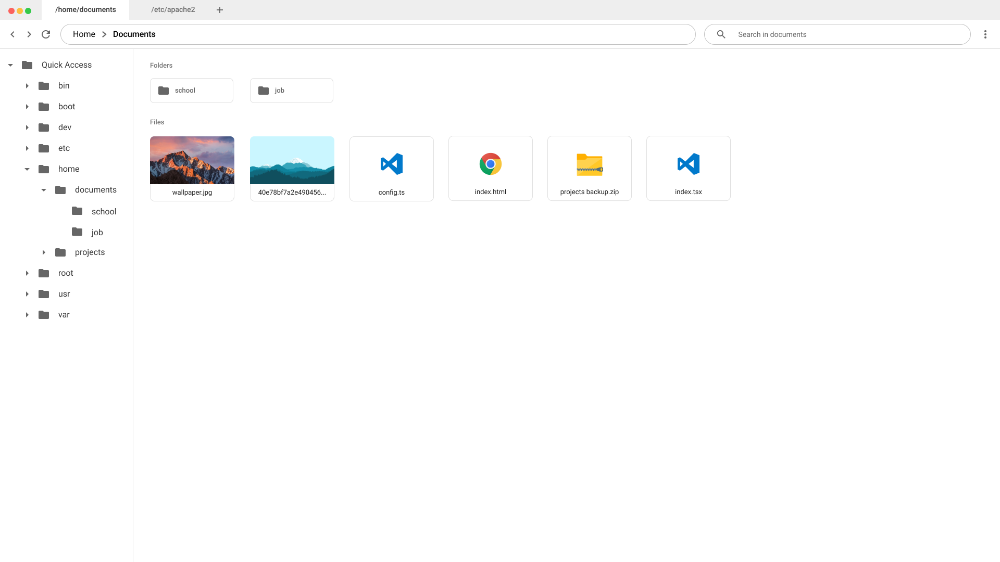

# Qusly

📁 An FTP/FTPS/SFTP client with Material Design UI. It's based on Electron, React and [Qusly-Core](https://www.github.com/xnerhu/qusly-core).

### Mockup

#### [Figma](https://www.figma.com/file/eyh03glsE1L1yBvAwQLLbkiC/Qusly---Redesign?node-id=1%3A2)

<div style="text-align: center">

</div>

### Running

```bash
$ npm run dev
```

```bash
$ npm run start
```
